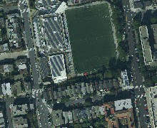

# WMTS smart cache
This project is a demonstration of a WMTS tile cache replacement strategy that is using a neural network. 

It was implemented based on ideas described by Garcia et al. in [1]. Romano and ElAarag in [2] describe a similar approach used for a more general case of web servers. The second document describes the Sliding Window idea in more depth - it's advised to read both documents for a more thorough understanding of this strategy.

For a brief summary of [1] see [this slide show](https://www.slideshare.net/beniamino/an-adaptive-neural-networkbased-method-for-tile-replacement-in-a-web-map-cache).

This document serves as brief documentation of the project explaining how to use it and what it does - details of the strategy can be found in aforementioned research papers.

# Dependencies
Project was developed using Python 3.11 and Docker 20.10. To run it you only need Docker since everything is in containers but if you wish to debug the Proxy you'll need Python 3.11 and some dependencies - listed in `proxy/requirements.txt`.

Proxy has to store some data it needs for the neural network. This is stored in `proxy_data` folder - it does not exist by default but is created when this project is first started or can be created with provided example data which can be found in zip file that is part of this repository. It is know bad practice to store binary files in Git repositories but this was the easiest thing to do for this small project.

It is recommended to use a GIS client for calling the WMTS service - QGIS 3.22 was used for testing.

This repository contains a very big folder - `maps`. It contains an orthophoto map of San Francisco that was created by USGS in 2015. The simplest thing to do was to keep this data in the repository using [Git Large File Storage](https://git-lfs.com/). The folders contents are used by Mapserver to generate images.

# Components
This is a distributed system. It consists of:
 - [Mapserver](https://mapserver.org/) - WMS provider used for tile generation.
 - [Mapcache](https://mapserver.org/mapcache/) - WMTS provider serving map tiles from a disc cache and requesting tiles from Mapserver if needed.
 - Proxy - entrypoint to the system that forwards WMTS requests to Mapcache. Keeps statistics of requested tiles and contains the neural network - this is the core of this project.

Mapsever and Mapcache components will not be described in detail since the least work was put into creating them - containers on which they are based were described in my engineering thesis "System dystrybucji informacji geograficznej".

# System overview
Since containers are in the same network they can communicate with each other freely, only the Proxy is exposed - on port 8184.

When you send a WMTS request to the Proxy it is forwarded to Mapcache. If it's a `GetTile` request Mapcache checks if the map tile is present in its cache or not. If it isn't, a `GetMap` request it sent to Mapserver to generate the tile. Once received by Mapcache it's stored in disc cache and then sent back to Proxy which calculates statistics described in [1].

Here is an overview of how `GetTile` requests are handled by the system:


# Proxy details
Proxy is written in Python and uses Flask. Code is in `proxy/app.py`

On startup the server checks if its working files exist. All files used by the Proxy can be found in `proxy_data` directory.
Files checked on start up are:
 - `tiles.db` - Sqlite database with table `tiles` containing a row for each tile that can be requested. Statistics associated with each tile are kept there, the last time it was requested (used for calculating statistics) and the output of neural networks. A tile can be identified by three columns - `matrix`, `row`, `column`. Refer to [this document](https://www.ogc.org/standards/tms) for details on the topic of Tile Matrix Sets. Statistics are described in [1] and [2]. `cacheability` column indicates if in this moment in time the tile is worth keeping in cache - this value is set by custom neural network created as part of this project. `cacheability_baseline` means the same as previous column but is set by a neural network created using Sklearn - it was added to compare the custom network to a state of the art implementation.
 If this database does not exist then it is created - see line 475. If it exists it will be queried for highest and lowest values of each statistic and these will be used for on the fly data normalization - required to feed data to neural networks during request handling.
 - `NEURAL_NETWORK_PARAMS.pkl` - binary file that contains parameters of custom neural network. Read into memory if exists.
 - `BASELINE_NEURAL_NETWORK.pkl` - binary file with Sklearn neural network. Read into memory if exists.

Both files associated with neural networks are created/updated when training is triggered.

Proxy has three endpoints: 'default' WMTS related endpoint and two unique to this server.

## WMTS
The 'default' endpoint forwards requests to Mapcache - must be correct WMTS requests, otherwise Mapcache will return an error. See line 417.

WMTS requests are either `GetCapabilities` or `GetTile`.

`GetCapabilities` will simply be forwarded to Mapcache and the response will be manipulated to create an illusion that the Proxy actually generated the response - see line 451. 

Example request: http://localhost:8184/USGS/wmts?REQUEST=Getcapabilities&SERVICE=WMTS&VERSION=1.0.0

Response is an XML file that describes the USGS service.

`GetTile` is a bit more complex since it involves calculating statistics based on historical data and putting them through neural networks to calculate if the tile is worth keeping in cache or not. On each request we update `tiles` row corresponding to the tile.
We keep track of the highest and lower values of each statistic and normalize them on the fly to feed them to neural networks - see lines 323 and 285. Each `GetTile` requests details are logged in `getTileStatistics.csv` to create a training set for neural networks.

Example request: http://localhost:8184/USGS/wmts?SERVICE=WMTS&REQUEST=GetTile&VERSION=1.0.0&LAYER=San_Francisco_2015&STYLE=default&FORMAT=image/jpeg&TILEMATRIXSET=San_Francisco&TILEMATRIX=6&TILEROW=25&TILECOL=25

Example `GetTile` response:



## Matrix statistics
This endpoint is used for visualizing statistics and output from neural networks - as heat maps. 

Each tile is stored in a TileMatrix that corresponds to a zoom level - numbered from 0 to 10. The higher the zoom level the more tiles there are. For TileMatrix `i` there are (2^`i`)^2 tiles since each TileMatrix is a square in this particular service. This means that getting statistics for higher zoom levels will take more time because there are more tiles.

Example request: http://localhost:8184/matrixStatistics/6

Example `matrixStatistics` response:


## Train
Like the name implies this endpoint is used for training neural networks.

When training is triggered we check for a `trainingSet.csv` file that will be split into a training set and testing set - 10% will be taken out for testing. If it's not preset `getTileStatistics.csv` will be used to create a new `trainingSet.csv` file. Creating it involves extracting statistics and setting targets for neural networks. Please refer to [1] and [2] for details on this.

This endpoint has three query string fields:
 - `epochs` - the number of training epochs - 1000 by default
 - `learning_rate` - value of the learning rate hyperparameter - 0.001 by default
 - `method` - training method to be used. Two are supported: adam ([method proposed by Kinmga and Ba](https://doi.org/10.48550/arXiv.1412.6980)) and sgd (Stochastic Gradient Descent with momentum constant equal to 0.9). By default adam is used. Depending on the training method different learning rates should be used: adam ~= 0.001, sgd ~= 0.05.

These parameters are used by both custom and Sklearn based neural networks. Nesterov momentum optimization is disabled in Sklearn because it was not implemented in the custom neural network. [MLPClassifier](https://scikit-learn.org/stable/modules/generated/sklearn.neural_network.MLPClassifier.html) was used.

Example request:
http://localhost:8184/train?epochs=1000&learning_rate=0.05&method=sgd

Response is a detailed training report from the custom network and accuracy got from Sklearn. Here is the tail of it (full report was 4011 lines long):
```
...
Iteration: 00997 - cost: 0.47492 - accuracy: 0.97999999999999998224
Iteration: 00998 - cost: 0.47884 - accuracy: 0.96999999999999997335
Iteration: 00999 - cost: 0.50086 - accuracy: 0.97499999999999997780
Best accuracy: 1.0
Reinitialized 3 times
Custom sgd accuracy: 0.9668935643564357
Sklearn sgd accuracy: 0.9777227722772277
```

After training both neural networks are saved to binary files described before and all rows in `tiles` get their `cacheability` and `cacheability_baseline` updated. The `trainingSet.csv` is kept for later - this is done for testing purposes, uncomment lines 203 and 204 for deletion to be automatic.

There is some file moving involved for keeping old `getTileStatistics.csv` and `trainingSet.csv` files around for testing - they end up in `statistics` and `trainingSets` directories respective. Refer to the code.

## Custom neural network details
The architecture of both Sklearn and custom neural networks is pretty much the same: 3 input nodes, 2 hidden layers with 3 nodes each, output layer with 1 node. The only difference are activation functions. Same as in [1] the activation function in hidden nodes is the sigmoid function and for output node it's the hyperbolic tangent. Sklearn does not support having different activation functions in output layers so each node uses the sigmoid function.

The custom neural network code is in a separate file `proxy/neural_network.py` and is strongly inspired by [this article](https://towardsdatascience.com/lets-code-a-neural-network-in-plain-numpy-ae7e74410795).

This is a simple neural network so there is no need to describe it in detail however some issues were encountered and some implementation details differ from the aforementioned article and they are worth highlighting.

### Network initialization
It was found that depending on initial values the network may not converge to a satisfactory accuracy.
The Normalized Xavier Weight Initialization method was used as described in [this article](https://machinelearningmastery.com/weight-initialization-for-deep-learning-neural-networks/).
However even using method the network would sometimes not converge so a network reinitialization approach is used. Basically if we don't hit accuracy over 95% we'll reinitialize the weights and try again - up to 10 times.

### Parameter selection
During training we keep track of the parameters that got us the best accuracy and after all the training is done we use them.

### Early stoppage
There are two early stoppage criteria:

1. When numeric error is hit (cost is NaN) we terminate the training session. We'll most likely not have found parameters that give us accuracy above 95% so the network will probably have to be reinitialized.
2. Cost or accuracy has not changed significantly over last 10 epochs. We have a Tolerance For Optimization constant equal to 1.0e-4. If cost or accuracy has not changed over that value we simply are not making progress so we stop.

# How to run it?
Unzip `proxy_data.zip` to create `proxy_data` directory and run `docker compose up -d`. This will build 3 images and start containers for each of them. By using a Docker volume files in `proxy_data` will be made available to the Proxy.

# How to use it?
This small system provides only one WMTS service that is available through the Proxy that is exposed on port 8184.

Use following request for `GetCapabilities`:
http://localhost:8184/USGS/wmts?REQUEST=Getcapabilities&SERVICE=WMTS&VERSION=1.0.0

In QGIS create a new WMTS connection by right clicking on 'WMS/WMTS' in the 'Browser' panel on the left and clicking on 'New Connection':


Then using above request, like this:


By doing so you've connected to the Proxy and you can browse the orthophoto map of San Francisco (photos from 2015) by sending `GetTile` requests.

The traffic is analyzed, statistics calculated and put through neural networks to determine whether or not a specific tile is worth caching on not.

Then you can see this data by sending the following request - http://localhost:8184/matrixStatistics/6

Train networks using http://localhost:8184/train

Remember to remove the old training set file before training if you'd like to train on data generated yourself. You can also uncomment lines 203 and 204 in `proxy/app.py` for deletion to be automatic.

---
---
# Bibliography
[1] "An Adaptive Neural Network-Based Method for Tile Replacement in a Web Map Cache" (DOI:10.1007/978-3-642-21928-3_6) by Garcia et. al.

[2] "A neural network proxy cache replacement strategy and its implementation in the Squid proxy server" (DOI:10.1007/s00521-010-0442-0) by Romano and ElAarag
