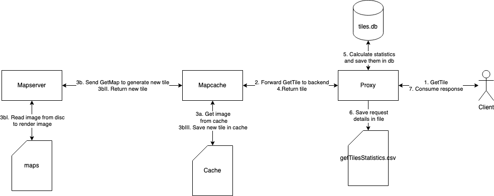
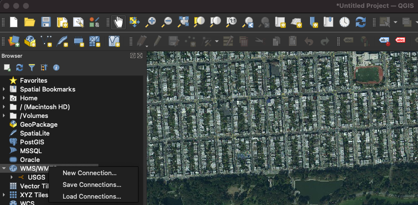
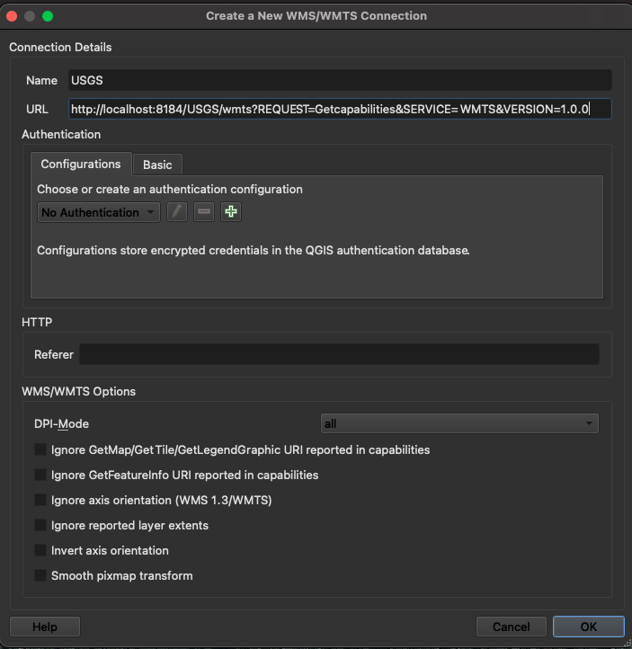
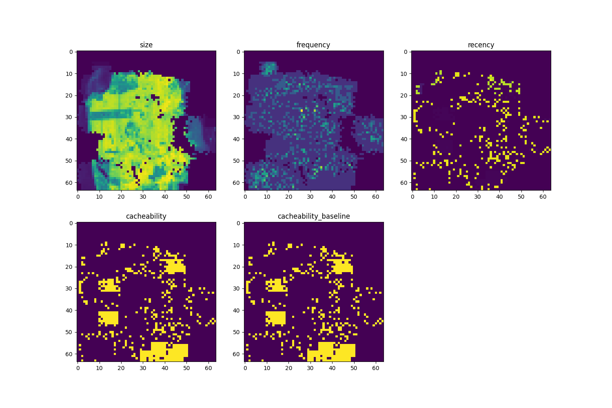

# WMTS_smart_cache

## Description
This project is a demonstration of a WMTS tile cache replacement strategy that is using a neural network. 

It was implemented based on ideas described by Garcia et al. in [1]. Romano and ElAarag in [2] describe a similar approach used for a more general case of web servers. The second document describes the Sliding Window idea in more depth - it's advised to read both documents for a more thorough understanding of this strategy. 

This document serves as brief documentation of the project explaining how to use it and what it does - details of the strategy can be found in aforementioned research papers.

---

## Dependencies
This project was developed using Python 3.11 and Docker 20.10. To run it you only need Docker since everything is in containers but if you wish to debug the Proxy you'll need Python 3.11 and some dependencies - listed in `proxy/requirements.txt`.

Proxy has to store some data it needs for the neural network. This is stored in `proxy_data` folder - it does not exist by default but is created when this project is first started or using provided example data. Example data can be found in zip file that is part of this repository - it is know bad practice to store binary files in Git repositories but this was the easiest thing to do for this small project.

It is also recommended to use some sort of WMTS client for calling the WMTS service - QGIS 3.22 was used for testing.

This repository contains a very big folder - `maps`. It contains an orthophoto map of San Francisco that was created by USGS in 2015. Because of that this repository is very big. The simplest thing to do in this small project was to keep this data in the repository using [Git Large File Storage](https://git-lfs.com/). Its contents are used by Mapserver to generate images.

---
## Components
This is a distributed system. It consists of:
 - Mapserver - WMS provider used for tile generation
 - Mapcache - WMTS provider serving map tiles from a disc cache and requesting tiles from Mapserver if needed
 - Proxy - entrypoint to the system that forwards WMTS requests to Mapcache. Keeps statistics of requested tiles and contains the neural network - this is the core of this project

Each component is isolated in a container.
Mapsever and Mapcache components will not be described in detail since the least work was put into creating them - containers on which they are based were described in my engineering thesis "System dystrybucji informacji geograficznej".

### Overview
When you send a WMTS request to the Proxy it is forwarded to Mapcache. If it's a GetTile request Mapcache checks if the map tile is present in its cache or not. If it isn't a GetMap request is send to Mapserver to generate the tile. Once received by Mapcache it is stored in cache send back to Proxy which calculates statistics described in [1]. 

Here is an overview of how GetTile requests are handled by the system:

All files used by the Proxy can be found in `proxy_data` directory. Statistics for each tile are stored in an Sqlite database called `tiles.db` - they can be viewed later. Additionally each GetTile request is stored in `getTileStatistics.csv`

### Proxy
The Proxy is written 

---
## How to run it?
Unzip `proxy_data.zip` to create `proxy_data` directory and run `docker compose up -d`. This will build 3 images and start containers for each of them. Using a volume files in `proxy_data` will be made available to the Proxy.

## How to use it?
This small system provides only one WMTS service that is available through the Proxy that is exposed on port 8184.

Use following request for GetCapabilities:
`http://localhost:8184/USGS/wmts?REQUEST=Getcapabilities&SERVICE=WMTS&VERSION=1.0.0`

In for example QGIS create a new WMTS connection by right clicking on 'WMS/WMTS' in the 'Browser' panel on the left and clicking on New Connection:

Then using above request, like this:

By doing so you've connected to the Proxy and are now sending GetTile requests to it and you can browse the orthophoto map of San Francisco (photos from 2015).

The traffic is analyzed - statistics are calculated and put through the neural network to determine whether or not a specific tile is worth caching on not.

To see this data you can send request the following request - `http://localhost:8184/matrixStatistics/4`

Output similar to this will be generated:

The three statistics on top are explained in [1] and [2]. `cacheability` 

---

## Bibliography
[1] "An Adaptive Neural Network-Based Method for Tile Replacement in a Web Map Cache" (DOI:10.1007/978-3-642-21928-3_6) by Garcia et. al.

[2] "A neural network proxy cache replacement strategy and its implementation in the Squid proxy server" (DOI:10.1007/s00521-010-0442-0) by Romano and ElAarag